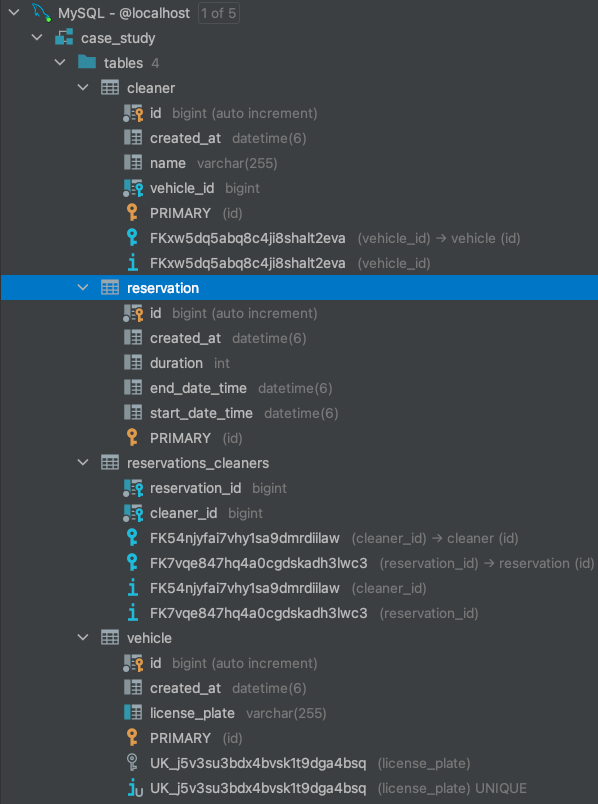
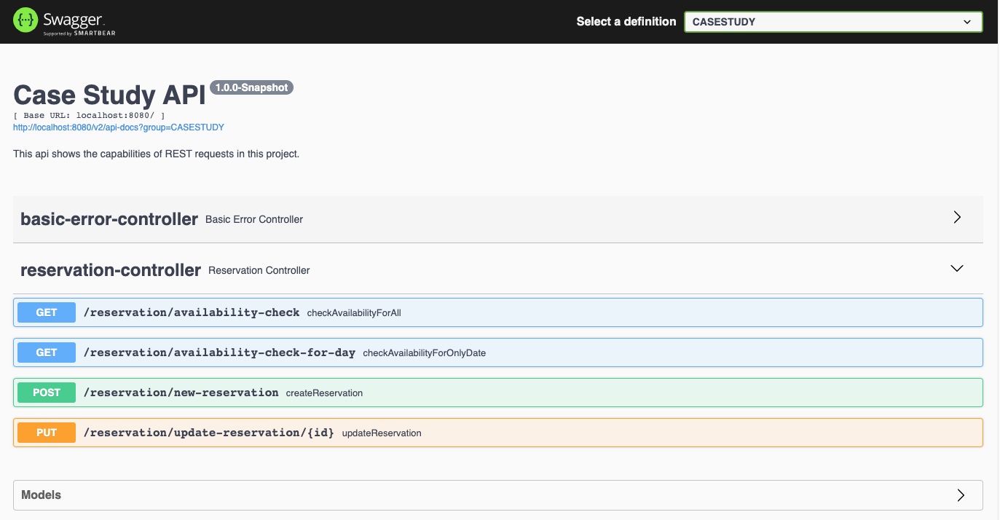
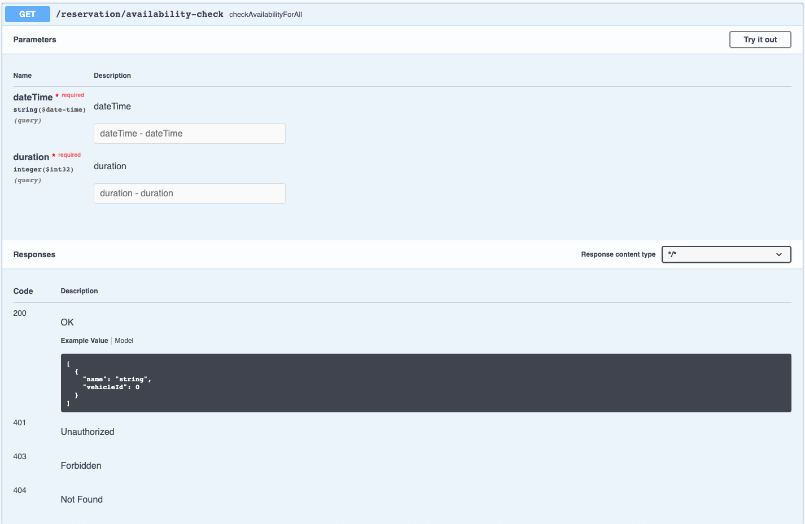
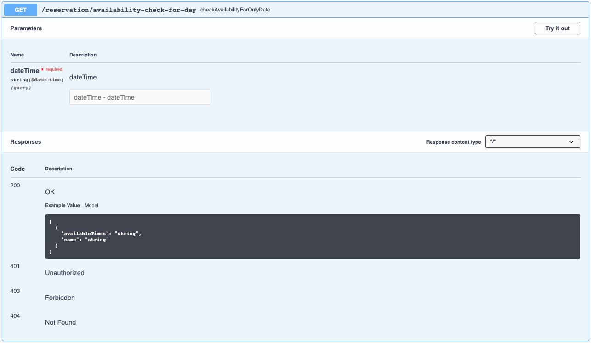
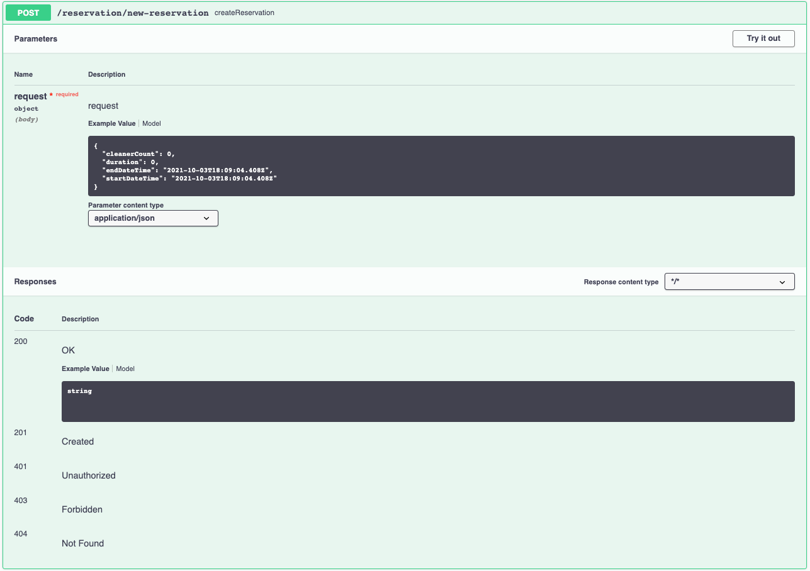
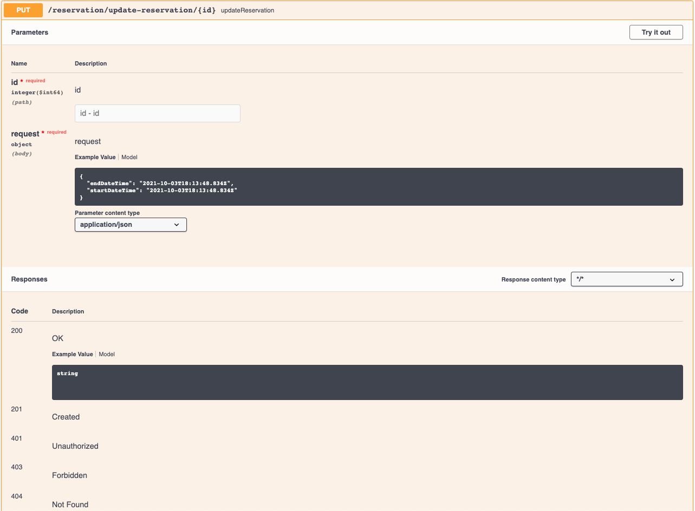

# Cleaner Case Study

Created a **Spring Boot** application with RESTful API to manage cleaner reservations.

You can:

1) Check for cleaners' availability based on day.
2) Check for cleaners' availability based on day, time, duration, and number of cleaners.
3) Create new cleaning reservations.
4) Update an existing cleaning reservation details.

----------

## Database architecture

## API Documentation

